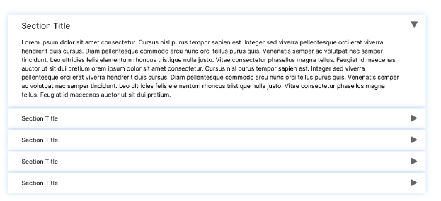

ทำ UI โดยใช้ function Component

-   Accordion สามารถเปิด-ปิดเพื่อแสดงเนื้อหาได้
-   Design : from figma community

[link](<"https://www.figma.com/file/MCpUA0RfrZtVuQGj0RfXru/Accordion-in-figma-(Community)?node-id=0%3A1&t=kri3UvCsoABxE2E9-1">)

