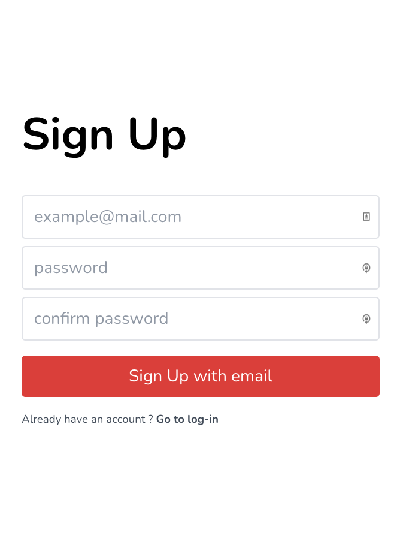

-   สร้าง UI สำหรับ SignUp ตามภาพ
-   ทำการ Validation
    -   ตรวจสอบว่า email มี @ และมี .com หากไม่มีให้แสดงผลเป็นข้อความสีแดงใต้ field ว่า Invalid Email
    -   ตรวจสอบว่า password ยาวมากกว่า 8 ตัว (ErrorMessage :password must be at least 8 characters)
    -   ตรวจสอบว่า confirmPassword ตรงกับ password (ErrorMessage :Password and confirm password does not match)
    -   ถ้าสมัครด้วย codecamp@mail.com ให้ แสดง error ว่า this email already use

