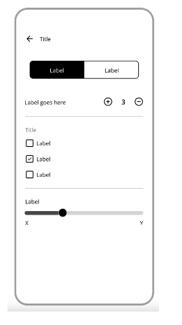

-   ทำ UI โดยใช้ function Component
-   มีการรับ Input จาก user มาเก็บไว้ใน state
    -   2 option label
    -   Quantity
    -   Checkbox
    -   range

#### Figma

[link](<https://www.figma.com/file/BzSc4uFpE01oZgiJOuJgVb/Mobile-Form-Patterns-(Community)-(Copy)?type=design&node-id=0-1&mode=design&t=M6qZtUqQKZfEObiM-0>)

### Preview

