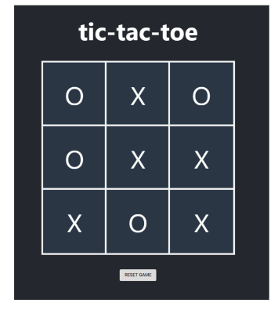

-   TASK-1 : ทำ UI สำหรับเกม tic-tac-toe
-   TASK-2 : ทำให้การ Click สามารถเพิ่ม X,O ลงตารางได้แบบสลับกัน
-   TASK-3 : ห้าม click ซ้ำช่องเดิมแล้วมีการแก้ไข X เป็น O หรือ O เป็น X ได้
-   TASK-4 : สามารถบอกได้ว่าใครชนะ เมื่อไหร่ (UI ทำเพิ่มจาก design ใต้ปุ่ม reset)
-   TASK-5 : Reset เกมได้
-   TASK-6 : สามารถบอกได้ว่าตาใครกำลังเล่น
    Player : X , Player O (UI ทำเพิ่มจาก design ใต้ปุ่ม reset)

