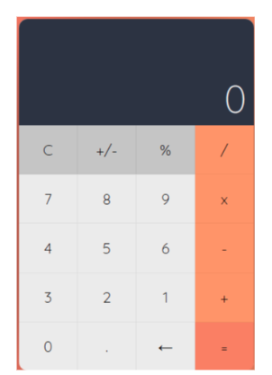

-   TASK-1 : ทำ UI เครื่องคิดเลข
-   TASK-2 : ทำให้กดเลขและเครื่องหมายแล้วแสดงผล
-   TASK-3 : ล้างค่าที่สะสมไว้เมื่อกดปุ่ม C
-   TASK-4 : ทำให้เครื่องคิดเลขสามารถคำนวณได้ และแสดงผลลัพธ์ที่ถูกต้องเมื่อกดเท่ากับ

